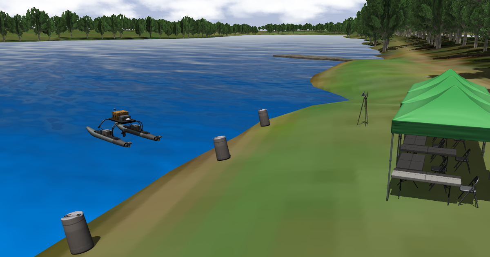

# Virtual RobotX (VRX)
This repository is the persional blog for the VRX simulation environment, which supports simulation of unmanned surface vehicles in marine environments.

## The VRX Competition
The VRX environment is also the "virtual venue" for the [VRX Competition](https://github.com/osrf/vrx/wiki). 

